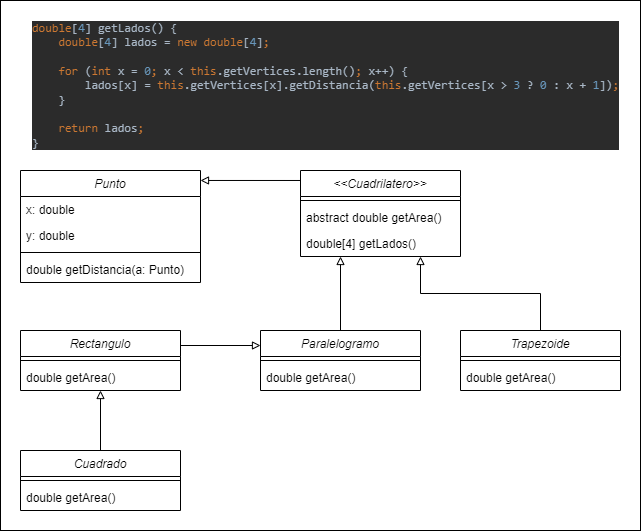

# Ejercicio Bonus

Escriba una jerarquía de herencia para las clases Cuadrilátero, Trapezoide, Paralelogramo, Rectángulo
 y Cuadrado. Use Cuadrilatero como la superclase de la jerarquía. Cree y use una clase Punto para
 representar los puntos en cada figura. Agregue todos los niveles que sea posible a la jerarquía. 
Especifique las variables de instancia y los métodos para cada clase. Las variables de instancia
 private de Cuadrilatero deben ser los pares de coordenadas x-y para los cuatro puntos finales
 del Cuadrilatero. Escriba un programa que cree instancias de objetos de sus clases, y que
 imprima el área de cada objeto (excepto Cuadrilatero). Generar mediante alguna herramienta
 de edición el diagrama UML del programa creado.

## Resolución

